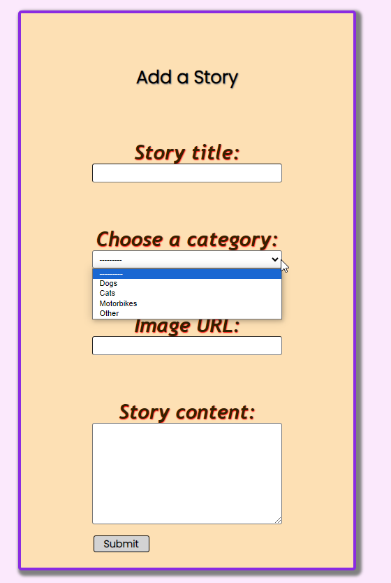
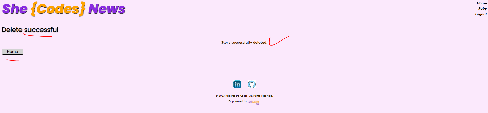

# Plus Resources: Django Project Starter

Starter code for the Plus Django project.

# Roberta De Cecco - She Codes News Project

## About This Project
This project was about creating a 'She Codes News!' website using Django framework and style it.
The purpose of the website is for users to read new stories and authors to create them.
Users need to be verified before being able to perform some actions, either logging in or creating an account else a graceful error message is displayed.

The website is NOT deployed so you can either check the screenshots provided, watch it:  or download the code and run the server locally - see instructions in the 'How to Run This Code' section.

## How To Run This Code
- Clone the repo to your local machine, 
- Create a virtual environment and activate it, 
- Install Django,
- Migrate the database (you need to be in the same directory of your `manage.py` file): `python manage.py migrate`  
- Launch the server: `python manage.py runserver`
- Copy the URL the above command returns (http://localhost.../) in the terminal and paste it into a web browser
- Once finished exploring the website, Quit the server in the terminal: `Ctrl+C`
- Deactivate your virtual environment

## Database Schema

## Project Features
- [x] Order stories by date (from latest to oldest - if a card is updated, card shown by last updated date)

- [x] Styled "new story" form

- [x] Story images

- [x] Log-in/log-out

- [x] "Account view" page

- [x] "Create Account" page

- [x] View stories by author

- [x] "Log-in" button only visible when no user is logged in/"Log-out" button only visible when a user *is* logged in
Already captured in other screenshots above.

- [x] "Create Story" functionality only available when user is logged in

## Additional Features:
- [P] Add categories to the stories and allow the user to search for stories bycategory.

 I haven't implemented the search by category but I display the chosen category at story creation, in each story card.

- [x] Add the ability to update and delete stories (consider permissions - whoshould be allowed to update or and/or delete stories).

- [x] Our form for creating stories requires you to add the publication date, update this to automatically save the publication date as the day the story was first published (maybe you could then add a field to show when the story was updated).
Already captured in other screenshots above.

- [x] Gracefully handle the error where someone tries to create a new story whenthey are not logged in.

- [N] Add the ability to “favourite” stories and see a page with your favouritestories.
Not implemented.

## Extras:
- [x] Add abililty to leave comments on a story.

- [x] Used the contrast checker to choose colours for the main fonts and background, to facilitate accessibility.
 and 

